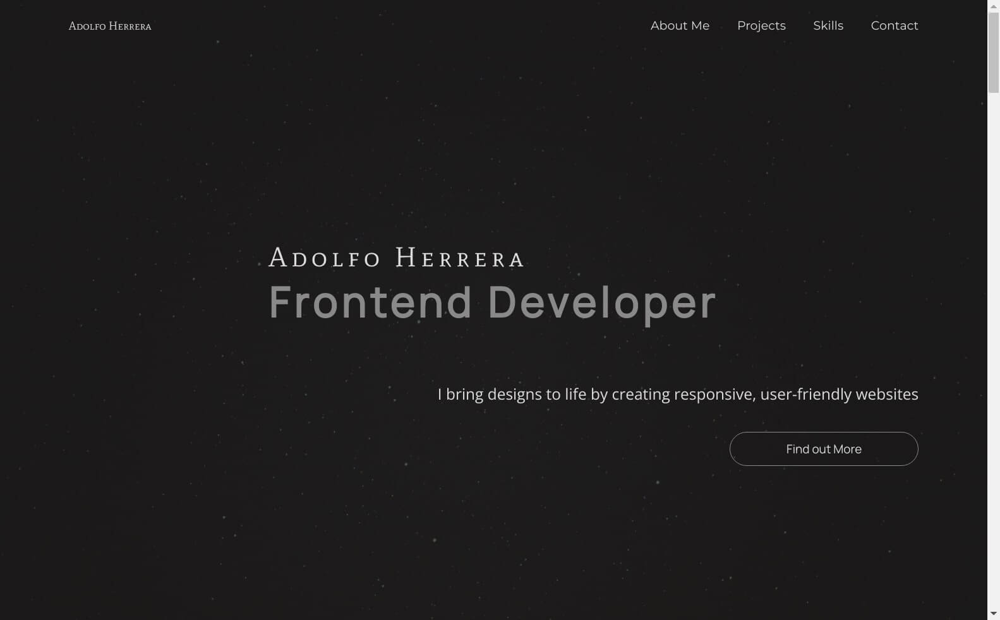

<h1 align="center">My Personal Portfolio</h1>

## Description

My Personal Portfolio is a website designed and developed by me to showcase my passion for front-end development. Through this platform, I present a collection of my projects, highlighting my proficiency in utilizing the latest web development tools and technologies.
In addition to demonstrating my technical skills, My Personal Portfolio serves as a testament to my creativity, attention to detail, and commitment to delivering exceptional user experiences.

### My Learning Experience

Building a personal portfolio using React, Framer Motion, and hosting it on Netlify was an incredible learning experience for me.
Throughout the development process, I gained valuable insights into the principles of modern web development and improved my technical skills in utilizing the latest tools and technologies.

Working with React and Framer Motion allowed me to create dynamic and visually appealing animations and transitions, while using Netlify's form services enabled me to add a contact form to my website easily. Moreover, hosting my site on Netlify provided me with the opportunity to learn more about deployment and continuous integration and deployment (CI/CD) pipelines.

## Demo

[portfolio](https://adolfoherrera.netlify.app/)

## Showcase

## Features

- **Responsive Design**: The portfolio website is designed to work seamlessly on all devices, including desktops, laptops, tablets, and smartphones.
- **Project Showcase**: Features a collection of past projects, with detailed descriptions and links to their live versions or source code repositories.
- **Contact Form**: Includes a contact form that enables visitors to reach out directly from the website. This feature utilizes Netlify's form services to handle form submissions.
- **Interactive Elements**: Incorporates interactive elements, such as hover effects, animations, and scrolling effects, to engage visitors and enhance the user experience.
- **Clean and Minimalistic Design**: Clean and modern design that is easy on the eyes and enables visitors to focus on the content without distractions.

## Technologies Used

- React
- HTML
- CSS
- Git
- Sass
- Framer Motion
- Netlify Forms

## Run Locally

- Clone this Repo
- Run npm install and npm run start to start the dev environment
- The application runs in http://localhost:3000/.
